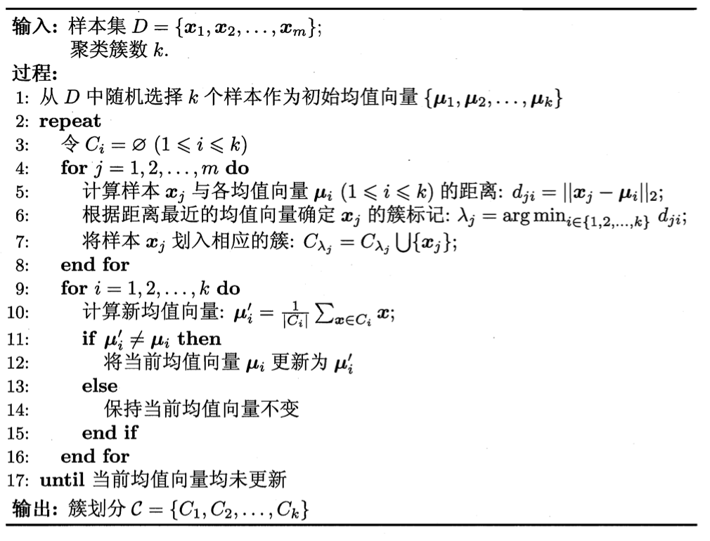
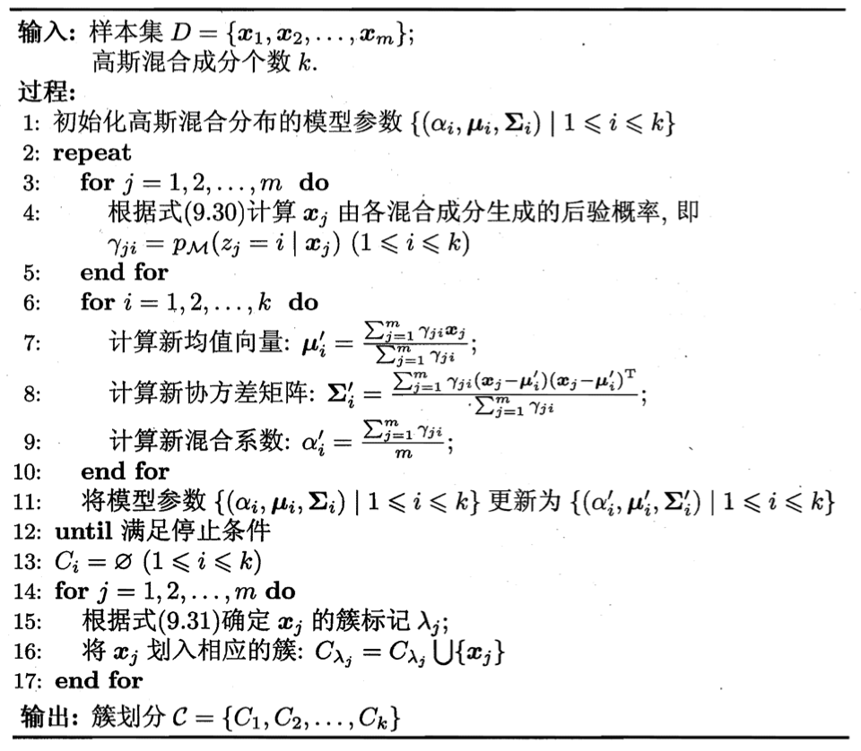

## 聚类性能度量

聚类性能度量：聚类**有效性指标**——簇内相似度高，簇间相似度低

衡量指标包括外部指标/内部指标

定义数据集$D=\{\boldsymbol x_1,\boldsymbol x_2,...,\boldsymbol x_m\}$，通过聚类给出的簇划分为$C=\{C_1, C_2,...,C_k\}$，参考模型给出的簇划分为$C^o=\{C_1^o, C_2^o,...,C_s^o\}$，$\lambda$、$\lambda^o$为对应的簇$C$、$C^o$标记向量 ，其中$\lambda_j$的值表示$\boldsymbol x_j$在第几类，即$\boldsymbol x_j \in C_{\lambda_j}$。将样本两两配对，定义

$$
a=|SS|, SS=\{(\boldsymbol{x}_i,\boldsymbol{x}_j)|\lambda_i=\lambda_j,\lambda_i^o=\lambda_j^o,i<j\}\\
b=|SD|, SD=\{(\boldsymbol{x}_i,\boldsymbol{x}_j)|\lambda_i=\lambda_j,\lambda_i^o\neq\lambda_j^o,i<j\}\\
c=|DS|, DS=\{(\boldsymbol{x}_i,\boldsymbol{x}_j)|\lambda_i\neq\lambda_j,\lambda_i^o=\lambda_j^o,i<j\}\\
d=|DD|, DD=\{(\boldsymbol{x}_i,\boldsymbol{x}_j)|\lambda_i\neq\lambda_j,\lambda_i^o\neq\lambda_j^o,i<j\}\\
$$

$SS$包含在$C$、$C^o$中均隶属于相同簇的样本对，$SD$包含在$C$属于同一簇，在$C^o$中隶属于不同簇的样本对。$SS$属于聚类完全正确，$DD$属于聚类结果正确。

聚类性能度量外部指标：

- **Jaccard系数 JC**

$$
JC=\frac{a}{a+b+c}
$$

- **FM指数 FMI**

$$
FMI=\sqrt{\frac{a}{a+b}·\frac{a}{a+c}}
$$

- **Rand指数 RI**

$$
RI=\frac{2(a+d)}{m(m-1)}
$$

结果值在$[0,1]$区间，值越大越好。

---

## K均值算法 *k-means* 🥝 

最小化平方误差

$$
E=\sum_{i=1}^k\sum_{\boldsymbol{x}\in C_i}\|\boldsymbol{x}-\boldsymbol{\mu}_i\|_2^2
$$

其中$\boldsymbol \mu_i=\frac{1}{\vert C_i\vert}\sum_{\boldsymbol x\in C_i}\boldsymbol{x}$ 是簇$C_i$的均值向量(中心)，$E$刻画了簇内样本与中心$\boldsymbol{\mu}_i$的紧密程度。$E$越小，簇内样本相似度越高。

---

---

##  高斯混合聚类 Gaussian Mixture Model —— GMM 🥑

高斯分布概率密度：

$$
f(x)= \frac{1}{\sqrt {2 \pi} \sigma}e^{-\frac{(x-\mu)^2}{2\sigma^2}}
$$

多元高斯分布的概率密度函数：

$$
p(\boldsymbol{x})=\frac{1}{(2\pi)^{\frac{n}{2}}|\boldsymbol{\Sigma}|^{\frac1{2}}}e^{-\frac{1}{2}(\boldsymbol{x}-\boldsymbol\mu)^T\boldsymbol{\Sigma}^{-1}(\boldsymbol{x}-\boldsymbol\mu)}
$$

其中$\mu$是$n$维均值向量，$\boldsymbol{\Sigma}$是$n\times n$的协方差矩阵。高斯分布完全由均值向量$\boldsymbol\mu$，协方差矩阵$\boldsymbol{\Sigma}$确定。将概率密度函数记为$p(\boldsymbol{x}\vert\boldsymbol{\mu}_i,\boldsymbol\Sigma_i)$，定义高斯混合分布如下

$$
p_\mathcal{M}(\boldsymbol{x})=\sum_{i=1}^k\alpha_i·p(\boldsymbol{x}|\boldsymbol\mu_i,\boldsymbol{\boldsymbol{\Sigma}}_i)
$$

高斯混合分布由$k$个**混合成分**组成，每个混合成分对应一个高斯分布。其中$\mu_i$与$\boldsymbol \Sigma_i$是第$i$个高斯混合成分的参数，$\alpha_i>0$为相应的**混合系数**，$\sum_{i=1}^k\alpha_i = 1$. 混合系数本质上是第$i$类样本所占整体样本的比例，从另一个角度看则是样本属于第$i$簇的概率。

使用高斯混合分布的模型在样本空间中生成样本的过程：以$\alpha_1,\alpha_2,...,\alpha_k$作为概率选择出一个混合成分，根据该混合成分的概率密度函数，采样产生出相应的样本。

给定样本集$D$，可使用**极大似然估计**，即最大化对数似然函数

$$
\begin{align}
LL(D) & = \ln \left( \prod \limits_{j=1}^mp_\mathcal{M}(\boldsymbol{x}_j) \right)\\ 
& = \sum \limits_{j=1}^m \ln \sum_{i=1}^k\alpha_i·p(\boldsymbol{x}|\boldsymbol\mu_i, \boldsymbol{\Sigma}_i)
\end{align}
$$

常用$EM$算法进行迭代优化求解

###  期望—最大化 Expectation-Maximization —— EM 🥭

设训练集为$D=\{\boldsymbol{x}_1,\boldsymbol{x}_2,...,\boldsymbol{x}_m\}$为高斯混合分布模型生成的样本，设$z_j$表示生成样本 $\boldsymbol{x}_j$的高斯混合成分，即$P(z_j=i)$对应于$\alpha_i(i=1,2,...,k)$。根据**贝叶斯定理**，$z_j$的后验分布对应样本$\boldsymbol{x}_j$由第$i$个高斯混合分布成分生成的**后验概率**，简记为$\gamma_{ji}$

$$
\begin{align}
\gamma_{ji}= p_\mathcal{M}(z_j=i|\boldsymbol{x}_j) &= \frac{P(z_j=i)·p_\mathcal{M}(\boldsymbol{x}_j|z_j=i)}{p_\mathcal{M}(\boldsymbol{x}_j)} \\
& = \frac{\alpha_i·p(\boldsymbol{x}_j|\boldsymbol\mu_i,\boldsymbol\Sigma_i)}{\sum\limits_{l=1}^k\alpha_l·p(\boldsymbol{x}_j|\boldsymbol\mu_l,\boldsymbol\Sigma_l)}
\end{align}
$$

$\gamma_{ji}$是已知样本为$\boldsymbol{x}_j$，反推该样本属于第$i$类的概率。把$\boldsymbol{x}_j$暂时划分到概率最大的那一类，则样本$\boldsymbol{x}_j$的簇标记$\lambda_j$为

$$
\lambda_j = \mathop{\arg\max} \limits_{i\in{1,2,...,k}} \gamma_{ji}
$$

若参数$\{(\alpha_i,\boldsymbol\mu_i,\boldsymbol{\Sigma}_i)\}$能使似然函数最大化，由$\frac{\partial LL(D)}{\partial \boldsymbol\mu_i}= 0$有

$$
\boldsymbol \mu_i = \frac{\sum \limits_{j=1}^m \gamma_{ji} \boldsymbol x_j}{\sum \limits_{j=1}^m \gamma_{ji}} \tag{1}
$$

由$\frac{\partial LL(D)}{\partial \boldsymbol\Sigma_i}= 0$有

$$
\mathbf\Sigma_{i}=\cfrac{\sum \limits_{j=1}^m\gamma_{ji}(\boldsymbol x_{j}-\boldsymbol \mu_{i})(\boldsymbol x_{j}-\boldsymbol\mu_{i})^T}{\sum \limits_{j=1}^m\gamma_{ji}}\tag{2}
$$

每个高斯成分的混合系数由该成分的平均后验概率确定

$$
\alpha_i=\frac{1}{m}\sum \limits_{j=1}^m \gamma_{ji}\tag{3}
$$

EM算法：

1. E步：根据当前参数计算属于每个高斯成分的后验概率$\gamma_{ji}$
2. M步：根据$(1)(2)(3)$更新$\{(\alpha_i,\boldsymbol\mu_i,\boldsymbol{\Sigma}_i)\vert1\leq i \leq k\}$

---

---

初始化方案：

1. 协方差矩阵$\boldsymbol{\Sigma}_i$设为单位矩阵，每个模型比例的先验概率$\alpha_i = 1/k$，均值$\boldsymbol\mu_i$设为随机数
2. 由k-means聚类算法对样本进行聚类，利用各类的均值作为$\boldsymbol\mu_i$，并计算$\boldsymbol{\Sigma}_i$，$\alpha_i$取各类样本占样本总数的比例