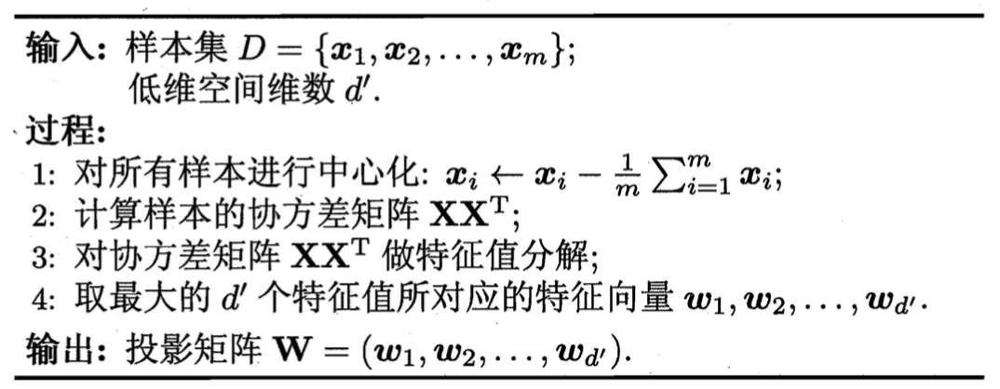

# 🍳 降维

## 主成分分析 *Principal Component Analysis* —— PCA

PCA的本质是将$n$维数据投影到$k$维空间中。若存在一个超平面，可以对正交属性空间中的样本点进行恰当的表达，那么这个超平面具有最近重构性和最大可分性。

- **最近重构性**：样本点到这个超平面的距离都足够近
- **最大可分性**：样本点在这个超平面上的投影尽可能分开

## 从最大可分性证明

​	样本点$\boldsymbol x_i $在新空间中超平面上的投影是$\bf W^T \boldsymbol x_i $，若使所有样本点的投影尽可能分开，则应该使投影后样本点的方差最大化。投影后样本点的方差为$\sum_i \bf W^T \boldsymbol x_i \boldsymbol x_i^T\bf W$，则优化目标和限制条件如下：

$$
\max_{\boldsymbol W} \ \rm{tr}( \bf W^T\bf X \bf X^T\bf W )
$$

$$
\rm {s.t.}  \bf W^T \bf W = \bf I
$$

使用拉格朗日乘子法：

$$
\bf X \bf X^T\bf W = \lambda \bf W
$$
对协方差矩阵$\boldsymbol X \boldsymbol X^T$进行特征值分解，并将求的的特征值进行排序，取前$k$个最大的特征值对应的特征向量构成投影矩阵$\bf W = \{\boldsymbol w_1,\boldsymbol w_2, \dots,\boldsymbol w_k\}$

注：

$$
{\bf X} =\left[    \begin{matrix}        {\boldsymbol x}^{(1)} - \overline {\bf X}\\        {\boldsymbol x}^{(2)}- \overline {\bf X} \\        \vdots \\        {\boldsymbol x}^{(m)} - \overline {\bf X}   \end{matrix}    \right] =    \left[        \begin{matrix}            x^{(1)}_{1}- \overline {x}_1 & x^{(1)}_{2}- \overline {x}_2   & \cdots & x^{(1)}_{n}- \overline {x}_n   \\            x^{(2)}_{1}- \overline {x}_1 & x^{(2)}_{2} - \overline {x}_2  & \cdots & x^{(2)}_{n}- \overline {x}_n   \\            \vdots & \vdots & \ddots & \vdots \\            x^{(m)}_{1}- \overline {x}_1 & x^{(m)}_{2}- \overline {x}_2 & \cdots & x^{(m)}_{n}- \overline {x}_n        \end{matrix}        \right]
$$

故$\boldsymbol X \boldsymbol X^T$为协方差矩阵

## 算法流程

给定数据集$D = \{ \boldsymbol x_1, \boldsymbol x_2, \dots, \boldsymbol x_m\}$，对样本进行中心化，即

$$
\boldsymbol x_i \leftarrow \boldsymbol x_i - \boldsymbol \mu
$$

其中${\boldsymbol \mu} = \frac{1}{m}\sum\limits_{j = 1}^m{\boldsymbol x}_j$，为数据集的$D$的均值向量。这个步骤相当于平移坐标轴到所有数据点的平均中点位置。

​	当数据受到噪声影响时，最小的特征值对应的特征向量往往与噪声有关，将它们舍弃在一定程度上起到去噪的效果。

## 信噪比 SNR —— *Signal to Noise Ratio*

信噪比公式如下：

$$
{SNR} = 10·\log_{10}\left[\frac{\sum\limits_{x=1}^{N_x}\sum\limits_{y=1}^{N_y}\left[f(x,y)\right]^2}{\sum\limits_{x=1}^{N_x}\sum\limits_{y=1}^{N_y}\left[f(x,y)-\hat f(x,y)\right]^2}\right]
$$

设样本个数为$m$，维数为$n$
$$
\hat y = X^T\boldsymbol \theta_0 + \sum_{j=1}^Mc_j·\max
\{0,X^T\boldsymbol \theta_j\}
$$

$$
\boldsymbol \theta = \left[\begin{matrix}     b  \\     \theta_1 \\    \theta_2\\  \vdots\\     \theta_n\end{matrix}\right],
\boldsymbol x = \left[\begin{matrix}   1\\   x_1  \\     x_2 \\       \vdots\\     x_n\end{matrix}\right] \rightarrow f(x)= \boldsymbol \theta^T \boldsymbol x
$$

$$
{\boldsymbol \theta} =\left[    
\begin{matrix}        
{\boldsymbol \theta}^{(1)}\\        
{\boldsymbol \theta}^{(2)} \\        
\vdots \\        
{\boldsymbol \theta}^{(M)} 
\end{matrix}    \right] =    
\left[        
\begin{matrix}            
\theta^{(1)}_{1} & \theta^{(1)}_{2}  &\dots& \theta^{(1)}_{n}   \\      

\theta^{(2)}_{1} & \theta^{(2)}_{2}  &\dots& \theta^{(2)}_{n}   \\   
\vdots&\vdots&\ddots&\vdots&\\

\theta^{(M)}_{1} & \theta^{(M)}_{2}  &\dots& \theta^{(M)}_{n}   \\   

\end{matrix}        
\right] 

\boldsymbol X = 
\left[
\begin{matrix}   
1&1&\dots&1\\  
x^{(1)}_1&x^{(2)}_1&\dots&x^{(m)}_1  \\     
x^{(1)}_2&x^{(2)}_2&\dots&x^{(m)}_2 \\       
\vdots\\     
x^{(1)}_n&x^{(2)}_n&\dots&x^{(m)}_n
\end{matrix}

\right]

\\

\boldsymbol \theta \boldsymbol X = 
\left[\begin{matrix}   
 
\boldsymbol \theta^{(1)}\boldsymbol x^{(1)} &
\boldsymbol \theta^{(1)}\boldsymbol x^{(2)} &
\dots &
\boldsymbol \theta^{(1)}\boldsymbol x^{(m)}\\ 

\boldsymbol \theta^{(2)}\boldsymbol x^{(1)} &
\boldsymbol \theta^{(2)}\boldsymbol x^{(2)} &
\dots &
\boldsymbol \theta^{(2)}\boldsymbol x^{(m)}\\    

\vdots&\vdots&\ddots&\vdots\\     
 
\boldsymbol \theta^{(M)}\boldsymbol x^{(1)} &
\boldsymbol \theta^{(M)}\boldsymbol x^{(2)} &
\dots &
\boldsymbol \theta^{(M)}\boldsymbol x^{(m)}\\   
\end{matrix}

\right]
\\
\boldsymbol \theta^{(j)} \boldsymbol x^{(k)} =  \sum  \boldsymbol \theta^{(j)}_i \boldsymbol x^{(k)}_i
$$

