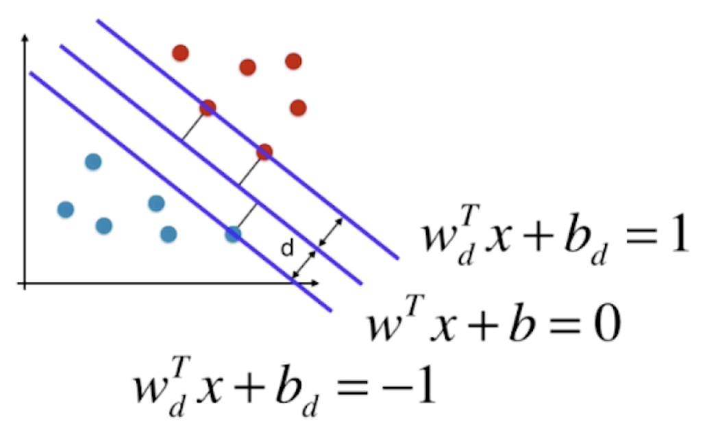

## Logistic代价函数推导SVM

0/1损失函数$l_{0/1}$非凸、非连续，数学性质差，故常用其他函数代替$l_{0/1}$

三种常用的替代损失函数：
$$
l_{hinge}(z) = \max(0,1-z)
$$

$$
l_{exp}(z) = e^{-z}
$$

$$
l_{log}(z) = log(1+e^{-z})
$$

### Logistic Regression

$$
\min_\theta \frac{1}{m} \left[ \sum_{i=1}^m y^{(i)}\left[-\log(h_{\theta}(x^{(i)}))\right]+(1-y^{(i)})\left[-\log(1-h_{\theta}(x^{(i)}))\right]\right]+\frac{\lambda}{2m}\sum_{j=1}^n\theta_j^2
$$

$$
\min_\theta  \left[ \sum_{i=1}^m 
y^{(i)}cost_1
+(1-y^{(i)})cost_0\right] 
+\frac{\lambda}{2}\sum_{j=1}^n\theta_j^2 
$$

$$
A + \lambda B
$$

### SVM

$$
C A + B
$$

$$
\min_\theta C  \sum_{i=1}^m\left[ y^{(i)}cost_1(\boldsymbol \theta^T\boldsymbol x^{(i)})+(1-y^{(i)})cost_0({\boldsymbol \theta}^T\boldsymbol x^{(i)})\right]+\frac{1}{2}\sum_{j=1}^n\theta_j^2
$$

其中SVM中的代价函数$cost$采用$hinge$损失
$$
l_{hinge}(z) = \max(0,1-z)
$$
如下所示：

可以直观地发现当$y=1$时，我们希望$\boldsymbol \theta^T\boldsymbol x \gg 1$，这样使$cost_1$最小；当$y=0$时，我们希望$\boldsymbol \theta^T\boldsymbol x \ll -1$，这样使$cost_0$最小。

---

## Margin

设划分超平面的方程为
$$
\boldsymbol w^T\boldsymbol x +b =0
$$

样本中任意点到该超平面的距离为
$$
d = \frac{\boldsymbol w^T x +b}{||\boldsymbol w||}
$$
对于$y=1$，$y=-1$两类样本点，任意点到超平面的距离应大于$d$
$$
\frac{\boldsymbol w^T  x^{(i)} +b}{||\boldsymbol w||} \geq d, \ \forall y^{(i)} = 1\\
\frac{\boldsymbol w^T  x^{(i)} +b}{||\boldsymbol w||} \leq -d, \ \forall y^{(i)} = -1
\\ \Downarrow \\
\frac{\boldsymbol w^T  x^{(i)} +b}{||\boldsymbol w||d} \geq 1, \ \forall y^{(i)} = 1\\
\frac{\boldsymbol w^T  x^{(i)} +b}{||\boldsymbol w||d} \leq -1, \ \forall y^{(i)} = -1
\\ \Downarrow \\
\boldsymbol w_d^T  x^{(i)} +b_d \geq 1, \ \forall y^{(i)} = 1\\
\boldsymbol w_d^T  x^{(i)} +b_d \leq -1, \ \forall y^{(i)} = -1
\\ \Downarrow \\
y^{(i)}(\boldsymbol w^T  x^{(i)} +b) \geq 1
$$

对于任意支撑向量，优化目标为最大化点到超平面的距离：

$$
\max \frac{|\boldsymbol w^T x +b|}{||\boldsymbol w||} \Rightarrow \max \frac{1}{||\boldsymbol w||}  \Rightarrow \min \frac{1}{2}||w||^2
$$

则SVM的优化目标为：

$$
\min_{\boldsymbol w,b} \frac{1}{2}||\boldsymbol w||^2 \\
{\rm{s.t.}} \ \ y^{(i)}(\boldsymbol w^T \boldsymbol x^{(i)}+b)\geq 1, \ i = 1,2,\dots,m.
$$

---

## 软间隔 Soft Margin SVM

非线性可分情况，允许误差$\xi_i$

L1正则

$$
\min_{\boldsymbol w,b} \frac{1}{2}||\boldsymbol w||^2 + C\sum_{i=1}^m \xi_i\\
{\rm{s.t.}} \ \ y^{(i)}(\boldsymbol w^T \boldsymbol x^{(i)}+b)\geq 1 - \xi_i \\\ i = 1,2,\dots,m,\ \xi_i\geq0
$$

L2正则

$$
\min_{\boldsymbol w,b} \frac{1}{2}||\boldsymbol w||^2 + C\sum_{i=1}^m \xi_i^2\\
{\rm{s.t.}} \ \ y^{(i)}(\boldsymbol w^T \boldsymbol x^{(i)}+b)\geq 1 - \xi_i \\\ i = 1,2,\dots,m,\ \xi_i\geq0
$$

---

## 拉格朗日对偶性 Lagrangian Duality

​	在约束最优化问题中，常常利用拉格朗日对偶性将原始问题转为对偶问题，通过解决对偶问题而得到原始问题的解。当满足一定条件时，原始问题与对偶问题的解是完全等价的。 

原始目标：

$$
\min_{\boldsymbol w,b} \frac{1}{2}||\boldsymbol w||^2
$$

$$
{\rm{s.t.}} \ \ y^{(i)}(\boldsymbol w^T \boldsymbol x^{(i)}+b)\geq 1, \ i = 1,2,\dots,m.
$$

使用拉格朗日乘法构造拉格朗日函数转化为无约束优化问题，其中拉格朗日乘子$\alpha_i\geq0$

$$
L(\boldsymbol w,b, \boldsymbol \alpha) = \frac{1}{2}||\boldsymbol w||^2 + \sum_{i=1}^m\alpha_i(1-y^{(i)}(\boldsymbol w^T \boldsymbol x^{(i)}+b))
$$

将$L(\boldsymbol w,b, \boldsymbol \alpha) $看作是关于$\boldsymbol \alpha$的函数，求

$$
\max_{\boldsymbol \alpha} L(\boldsymbol w,b, \boldsymbol \alpha)
$$

当某个约束条件不满足时，如$$y^{(i)}(\boldsymbol w^T \boldsymbol x^{(i)}+b)< 1$$，那么显然有$$\max\limits_{\boldsymbol \alpha} L(\boldsymbol w,b, \boldsymbol \alpha) = \infty$$（令$$\alpha_i=\infty$$即可）而当所有约束条件都满足时，则最优值为$$\frac{1}{2}\|\boldsymbol w\|^2$$，即最初要最小化的目标值。因此，在约束条件得到满足的情况下最小化$$\frac{1}{2}\|\boldsymbol w\|^2$$，等同于求$$\max\limits_{\boldsymbol \alpha} L(\boldsymbol w,b, \boldsymbol \alpha)$$的最小值。

原始目标变为

$$
\min_{\boldsymbol w,b}\max_{\boldsymbol \alpha} L(\boldsymbol w,b, \boldsymbol \alpha)
$$

这个问题只有在满足约束条件下才有极小值，也就是说这个问题的极小值一定满足约束条件。

令$\nabla_\boldsymbol w L = 0$，$\nabla_b L = 0$，得：

$$
\boldsymbol w =\sum_{i=1}^m\alpha_iy_i\boldsymbol x_i
$$

$$
\sum_{i=1}^m\alpha_iy_i = 0
$$

将其带入，则原始问题转化对偶问题：

$$
\max_\boldsymbol \alpha\sum_{i=1}^m \alpha_i-\frac{1}{2}\sum_{i=1}^m\sum_{j=1}^m\alpha_i\alpha_jy_iy_j\boldsymbol x_i\boldsymbol x_j \\
$$

$$
\begin{align}
{\rm{s.t.}} &\  \sum_{i=1}^m\alpha_iy_i = 0,\\ 
&\ \alpha_i\geq0, \ i = 1,2,\dots,m
\end{align}
$$

### 强对偶和弱对偶 strong and weak duality

原始问题 Primal Problem

$$
p^* = \min_w \max_{\alpha_i \geq 0} L(\boldsymbol w,b, \boldsymbol \alpha)
$$
对偶问题 Dual Problem   

$$
d^* = \max_{\alpha_i \geq 0}\min_w  L(\boldsymbol w,b, \boldsymbol \alpha)
$$
弱对偶性：
$$
d^* \leq p^*
$$
强对偶性：
$$
d^* = p^*
$$

### KKT conditions

- 定常方程式 stationary equation

$$
\nabla_\boldsymbol w L = 0 
$$

$$
\nabla_b L = 0
$$

- 原始可行性 primal feasibility 

$$
y^{(i)}(\boldsymbol w^T \boldsymbol x^{(i)}+b)\geq 1
$$

- 对偶可行性 dual feasibility 

$$
\alpha_i \geq 0
$$

- 辅松弛 complementary slackness 

$$
\alpha_i(y^{(i)}f(x^{(i)})-1)=0
$$

---

## 核函数 Kernel Trick

在**线性不可分**的情况下，支持向量机首先在低维空间中完成计算，然后通过核函数将输入空间映射到高维特征空间，最终在高维特征空间中构造出最优分离超平面，从而把平面上本身不好分的非线性数据分开——依靠升维使原本线性不可分的数据线性可分

SVM优化问题经过对偶转化为了

$$
\max_\boldsymbol \alpha\sum_{i=1}^m \alpha_i-\frac{1}{2}\sum_{i=1}^m\sum_{j=1}^m\alpha_i\alpha_jy_iy_j\boldsymbol x_i\boldsymbol x_j
$$

$$
\begin{align}
{\rm{s.t.}} &\  \sum_{i=1}^m\alpha_iy_i = 0,\\ 
&\ \alpha_i\geq0, \ i = 1,2,\dots,m
\end{align}
$$

可以看到数据点仅出现为为内积$\boldsymbol x_i\boldsymbol x_j$

只要能在特征空间中计算出内积，就不需要显式的映射。而且许多常见的几何操作（角度、距离）可以用内积表示。减少计算量和储存空间。

定义核函数${\rm{K}} (\boldsymbol x_i,\boldsymbol x_j)=\boldsymbol x_i'·\boldsymbol x_j'=(\boldsymbol x_i·\boldsymbol x_j+1)^2$

核函数本质是将数据添加多项式特征 $x \rightarrow x'$

$$
x'= (x_n^2,\dots,x_1^2,\sqrt2 x_nx_{n-1},\dots,\sqrt2x_n\dots,\sqrt2 x_1,1)
$$

- 核函数不是SVM专有
- 存在$\boldsymbol x_i·\boldsymbol x_j$即可应用核函数

#### 核函数类型

1. 线性核函数 *Linear kernel*

$$
{\rm{K}} (\boldsymbol x_i,\boldsymbol x_j)=\boldsymbol x_i·\boldsymbol x_j
$$

2. 多项式核函数 *Polynomial kernel* 

$$
{\rm{K}} (\boldsymbol x_i,\boldsymbol x_j)=(\boldsymbol x_i·\boldsymbol x_j+1)^d
$$

3. 高斯核函数 /  径向基函数 Radial Basis Function Kernel —— RBF

$$
{\rm{K}} (\boldsymbol x_i,\boldsymbol x_j)=e^{-\gamma||\boldsymbol x_i-\boldsymbol x_j||^2}
$$

将每个样本点映射到无穷维的特征空间，每个数据点都是landmark
$$
x \rightarrow (e^{-\gamma||\boldsymbol x-\boldsymbol l_1||^2},e^{-\gamma||\boldsymbol x-\boldsymbol l_2||^2})
$$

$$
m \times n \rightarrow m \times m
$$

原本$n$维的数据升为$m$维（$m$为数据量）

应用：自然语言处理

---

## SVM思想解决回归问题

核心思想：在margin里包含的样本点越多越好

超参数$\epsilon$指定margin到中间直线的距离