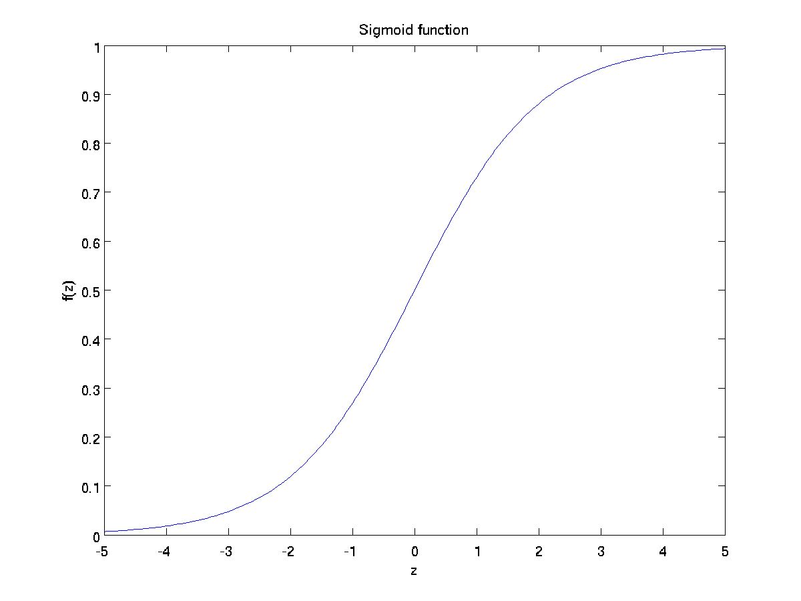

## 对数几率回归 Logitstic Regression

考虑二分类任务，将线性回归模型的预测值$h(\boldsymbol x) =\boldsymbol{w}^T\boldsymbol{x} + b$转换为0/1值

### 对数几率函数 Sigmoid

$$
y = \frac{1}{1+e^{-z}}
$$

当$z>0$时，$Sigmoid>0$，且$z$越大，$Sigmoid$越接近$1$；$z<0$时，$Sigmoid<0$，$z$越小，$Sigmoid$越接近$0$。

将$h(\boldsymbol x)$代入，可将预测值转换为0/1值，得

$$
\hat y = \frac{1}{1+e^{-(\boldsymbol{w}^T\boldsymbol{x}+b)}}
$$

线性模型可表示为

$$
h =\boldsymbol{w}^T\boldsymbol{x} + b = \ln \frac{y}{1-y}
$$

设$y$为样本$\boldsymbol{x}$为正例的可能性，即后验概率估计$p(y=1{\vert}\boldsymbol{x})$，$1-y$为反例的可能性

$$
\hat y = \frac{1}{1+e^{-(\boldsymbol{w}^T\boldsymbol{x}+b)}}
$$

$$
\ln \frac{y}{1-y}=\boldsymbol{w}^T\boldsymbol{x}+b = \ln \frac{p(y=1|\boldsymbol{x})}{p(y=0|\boldsymbol{x})}
$$

其中$\frac{y}{1-y}$为**几率**odds，$\ln \frac{y}{1-y}$为**对数几率**logit

概率分布如下

$$
p(y=1|\boldsymbol{x}) = \frac{e^{\boldsymbol{w}^T\boldsymbol{x}+b}}{1+e^{\boldsymbol{w}^T\boldsymbol{x}+b}}\\
p(y=0|\boldsymbol{x}) = \frac{1}{1+e^{\boldsymbol{w}^T\boldsymbol{x}+b}}
$$

可通过**极大似然法**估计$\boldsymbol{w}$和$b$，设数据集为$\{(\boldsymbol{x_i},y_i)\}_{i-1}^m$

$$
\ln L(\boldsymbol{w},b)=\sum _{i=1}^m \ln p(y_i|\boldsymbol{x}_i;\boldsymbol{w},b)
$$

### 代价函数 Cost Function

由于的$Sigmoid$函数使之前使用的代价函数成为非凸函数，定义新代价函数为

$$
Cost(\hat y (x),y) = 
\left\{
 \begin{array}{**}
-\log(\hat y) , y = 1 \\
-\log(1-\hat y) , y = 0
\end{array}
\right. 
 = -y\log(\hat y)-(1-y)\log(1-\hat y)
$$

$$
\begin{align}{}
Loss& =\frac{1}{m}\sum_{i=1}^mCost(\hat y ^{(i)},y^{(i)}) \\
& = -\frac{1}{m}\sum_{i=1}^m [y^{(i)}\log\hat y ^{(i)}+(1-y^{(i)})\log(1-\hat y ^{(i)}) ]
\end{align}
$$

$Loss$的导数化简结果如下：
$$
Loss(\boldsymbol \theta)= -\frac{1}{m}\sum_{i=1}^m [y^{(i)}\log\frac{1}{1+e^{-\boldsymbol{\theta}^T\boldsymbol{x}}}+(1-y^{(i)})\log(1-\frac{1}{1+e^{-\boldsymbol{\theta}^T\boldsymbol{x}}} ]
$$

$$
\frac{\partial Loss}{\partial \boldsymbol \theta_j} = 
\frac{1}{m}\sum_{i=1}^m(\hat y^{(i)}-y^{(i)})x_j^{(i)}
$$

### 梯度下降 Gradient Descent

如果$Loss(\boldsymbol w )$如果在$\boldsymbol w_i$点可微且有定义，梯度 $\nabla Loss(\boldsymbol w _i)$为函数增长最快的方向，因此梯度的反方向$-\nabla Loss(\boldsymbol w _i)$为函数下降最快的方向。设$\alpha$为学习率，可以用以下公式进行迭代：

$$
\begin{align}{}
\boldsymbol w _{i+1}& = \boldsymbol w _i − α \nabla Loss(\boldsymbol w _i)\\
& = \boldsymbol w _i − α \frac{\partial}{\partial\boldsymbol w _i}Loss(\boldsymbol w) \\
& = \boldsymbol w _i − α \frac{1}{m} \sum_{j=1}^m (\hat y^{(j)}-y^{(j)})x_i^{(j)} 
\end{align}
$$

### 正则化

向代价函数中加入L2正则项

$$
Loss =\frac{1}{m}\sum_{i=1}^m [Cost(\hat y (x)^{(i)},y^{(i)})+\lambda \sum \limits_{j=1}^n \boldsymbol w^2_j]
$$

梯度下降法迭代公式为

$$
\boldsymbol w _{i+1}= \boldsymbol w _i − α \frac{1}{m} \sum_{j=1}^m (\hat y(x^{(j)})-y^{(j)})x_i^{(j)} + \frac{\lambda}{m}\boldsymbol w _i
$$

### 优化目标

$$
\min_\theta \frac{1}{m} \left[ \sum_{i=1}^m y^{(i)}\log(h_{\theta}(x^{(i)}))+(1-y^{(i)})\log(1-h_{\theta}(x^{(i)}))\right]+\frac{\lambda}{2m}\sum_{j=1}^n\theta_j^2
$$

