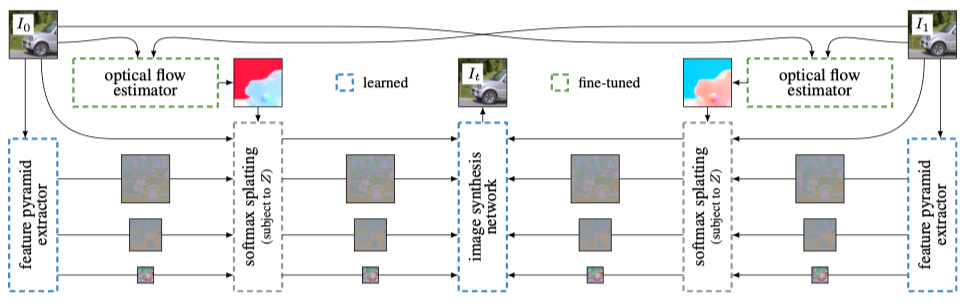

# Softmax Splatting for Video Frame Interpolation

###### Simon Niklaus, et al. - In *CVPR*, 2020.

论文提出了一种可微分的 forward warping 的方法 —— **softmax splatting** ，解决了多个源像素映射到同一目标像素的冲突问题；使用了特征金字塔成功实现了高质量图像合成。

### Softmax splating 

作者从直接对采样结果加权求和的简单方案开始，针对当前算法的处理缺点不断对其进行优化改造

#### 1. Summation splatting

$$
\begin{aligned}
\text { let } \boldsymbol{u} &=\boldsymbol{p}-\left(\boldsymbol{q}+F_{0 \rightarrow t}[\boldsymbol{q}]\right) \\
b(\boldsymbol{u}) &=\max \left(0,1-\left|\boldsymbol{u}_{x}\right|\right) \cdot \max \left(0,1-\left|\boldsymbol{u}_{y}\right|\right) \\
I_{t}^{\Sigma}[\boldsymbol{p}] &=\sum_{\forall \boldsymbol{q} \in I_{0}} b(\boldsymbol{u}) \cdot I_{0}[\boldsymbol{q}] \\
\end{aligned}
$$

$$
\vec{\Sigma} \left(I_{0}, F_{0 \rightarrow t}\right)=I_{t}^{\Sigma}
$$

- 向量 $\boldsymbol u$ 为 $t$ 时刻下，目标点 $\boldsymbol p$ 与 $I_0$ 中经过扭曲到 $t$ 时刻的像素点 $\boldsymbol q$ 的差值

- 双线性核 $b$ 对于距离差值向量  $\boldsymbol u$， 距离越小，$b(\boldsymbol u)$ 越小。$\boldsymbol u_x$ 或 $\boldsymbol u_y > 1$ 时，$b(\boldsymbol u) = 0$ 

- 对于结果 $I_{t}^{\Sigma}[\boldsymbol{p}]$，将原图像 $I_0$ 根据权重 $b(\boldsymbol u)$ 直接加权求和

  

  此方法将导致**亮度不一致**：

  - 当多个像素映射到统一区域时，此算法对重叠部分像素直接求和，导致重叠区域过亮
  - 受双线性核 $b$ 影响，$I_t$ 中的像素只接受 $I_0$ 像素的部分作用，也导致亮度不一致

#### 2. Average splatting

$$
\vec{\Phi} \left(I_{0}, F_{0 \rightarrow t}\right) = \frac{\vec{\Sigma} \left(I_{0}, F_{0 \rightarrow t}\right)}{\vec{\Sigma} \left(\boldsymbol1, F_{0 \rightarrow t}\right)}
$$

- 对 summation splatting 进行归一化，解决了亮度不一致问题
- 由于对重叠区域取平均，所以将产生重影

#### 3. Linear splatting

$$
\vec{*} \left(I_{0}, F_{0 \rightarrow t}\right) = \frac{\vec{\Sigma} \left(Z ·I_{0}, F_{0 \rightarrow t}\right)}{\vec{\Sigma} \left(Z, F_{0 \rightarrow t}\right)}
$$

- 引入包含图像深度信息的 mask Z 来解决多个像素映射到同一位置的冲突，运动的前景具有更大的权重，背景具有更小的权重
- 当前景 Z​ 与背景 Z​ 区分不大时将被计算均值，无法清晰地分离前景与背景

#### 4. Softmax splatting

$$
\vec{\sigma} \left(I_{0}, F_{0 \rightarrow t}\right) = \frac{\vec{\Sigma} \left(\exp(Z) ·I_{0}, F_{0 \rightarrow t}\right)}{\vec{\Sigma} \left(\exp(Z), F_{0 \rightarrow t}\right)}
$$

- 对权重 mask Z 进行一个类似于 softmax 的改进，使其更好地分离运动的前景与背景
- 根据 mask Z的平移不变性分离重叠区域

##### **mask Z**

计算像素的深度需要较大的计算代价且难以获得准确结果，所以使⽤亮度一致性来判断遮挡

$$
Z=\alpha \cdot\left\|I_{0}-\overleftarrow{\omega}\left(I_{1}, F_{0 \rightarrow 1}\right)\right\|_{1}
$$

- 使用 backward warping 计算亮度一致性

- 较小的 $\alpha$ 产生平均值，而较大的 $\alpha$ 产生 z-buffering。可以通过端到端训练学习参数 $\alpha$

- 由于提出的 softmax 展开是完全可微的，所以引入小型神经网络 $υ$ 进一步完善 Z

  
  $$
  Z=v\left(I_{0},-\left\|I_{0}-\overleftarrow{\omega}\left(I_{1}, F_{0 \rightarrow 1}\right)\right\|_{1}\right)
  $$

### Algorithm Frame Overview

1. **光流估计**：输入 $I_0$ $I_1$，使用 PWC-Net 计算 $F_{0\rightarrow1}$ $F_{1\rightarrow0}$
2. **提取特征⾦字塔**：输入原图像，经过六层卷积输出 32、64、96 三个尺寸的特征金字塔。
3. **softmax splatting**：将光流、特征金字塔、原图像在 Z 的约束下进⾏ softmax splatting，使用 U-net 进行微调

4. **图像合成**：输入扭曲处理过的图像 $I_t$ 及其对应的特征金字塔，使用 GridNet ⽹络⽣成插帧图像

### Experiments

- **Dataset**：Vimeo-90k、Middlebury、UCF101、Xiph 2
- **Metrics**：PSNR、SSIM、LPIPS：衡量感知相似度