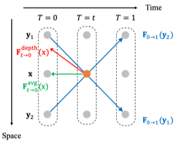
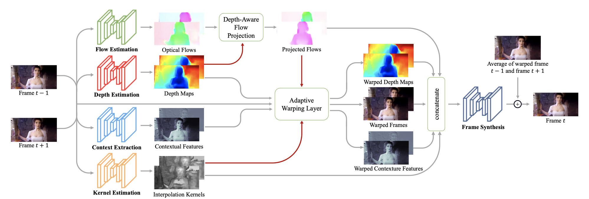

# Depth-Aware Video Frame Interpolation

###### Wenbo Bao, et al. - In *CVPR*, 2019.

论文显式地**通过深度信息探测视频遮挡情况**，使反向光流的计算中更倾向于对近处物体采样；利用分层特征和深度图作为上下文信息来合成中间框架；

### Depth-Aware Flow Projection

论文中使用 $\mathbf{F}_{0 \rightarrow 1}$ 中所有经过 $I_t$ 下目标像素 $\mathbf x$ 的光流加权平均来估计 $\mathbf{F}_{t \rightarrow 0}$ 

s

$$
\mathbf{F}_{t \rightarrow 0}(\mathbf{x})=-t \cdot \frac{\sum_{\mathbf{y} \in \mathcal{S}(\mathbf{x})} w_{0}(\mathbf{y}) \cdot \mathbf{F}_{0 \rightarrow 1}(\mathbf{y})}{\sum_{\mathbf{y} \in \mathcal{S}(\mathbf{x})} w_{0}(\mathbf{y})} \\
$$

- $\mathcal{S}(\mathbf x)$: 光流 $\mathbf{F}_{0 \rightarrow 1}$ 经过 $\mathbf x$ 的点的集合

- 权重 $w_0$ 是深度 $D_0$ 的倒数

  

$$
w_{0}(\mathbf{y})=\frac{1}{D_{0}(\mathbf{y})} \\
$$

这种方式可以使光流投影更倾向于对较近的对象进行采样，并减少具有较大深度值的被遮挡像素的权重

为了解决**空洞问题**，作者使用由外而内的策略：空洞位置的光流通过平均来自其相邻像素的光流来计算

$$
\mathbf{F}_{t \rightarrow 0}(\mathbf{x})=\frac{1}{|\mathcal{N}(\mathbf{x})|} \sum_{\mathbf{x}^{\prime} \in \mathcal{N}(\mathbf{x})} \mathbf{F}_{t \rightarrow 0}\left(\mathbf{x}^{\prime}\right)
$$

$\mathcal{N}(\mathbf{x}) = \{\mathbf{x}':|\mathcal S(\mathbf{x})|>0\}$ ：像素 $\mathbf{x}$ 的四个相邻像素

### Algorithm Frame Overview

1. **光流估计**：输入 $I_0$ $I_1$，使用 PWC-Net 计算光流
2. **深度估计**：输入 $I_0$ $I_1$，使用 hourglass architecture 计算Depth Maps
3. **生成中间流**：输入光流和深度图，使用论文提出的Depth-Aware Flow Projection生成中间流
4. **提取上下文特征**：输入 $I_0$ $I_1$，使用预训练的 ResNet 提取分层特征
5. **核估计**：使用 U-Net 对每一个像素估计 4×4 的插值核 
6. **自适应扭曲**：基于光流和空间变化的插值核，使用自适应变形对输入帧、Depth Maps 和上下文特征进行扭曲
7. **合成中间帧**：将变形处理过的输入帧、Depth Maps、上下文特征、中间流和插值核串联起来，作为帧合成网络的输入，输出中间帧。帧合成网络由 3 个 residual block 组成。

### Experiments

- Dataset: Vimeo90K、Middlebury、UCF101、HD
- Hyper-parameters:
  - Optimizer: AdaMax
    - $\beta_1 = 0.9$  $ \beta_2 = 0.999$
  - batch size: 2
  - initial learning rate $\alpha = 1e^{-4}$ 
  - iteration: 30 + 10 epochs

- Metricss: PSNR、SSIM、IE、NIE