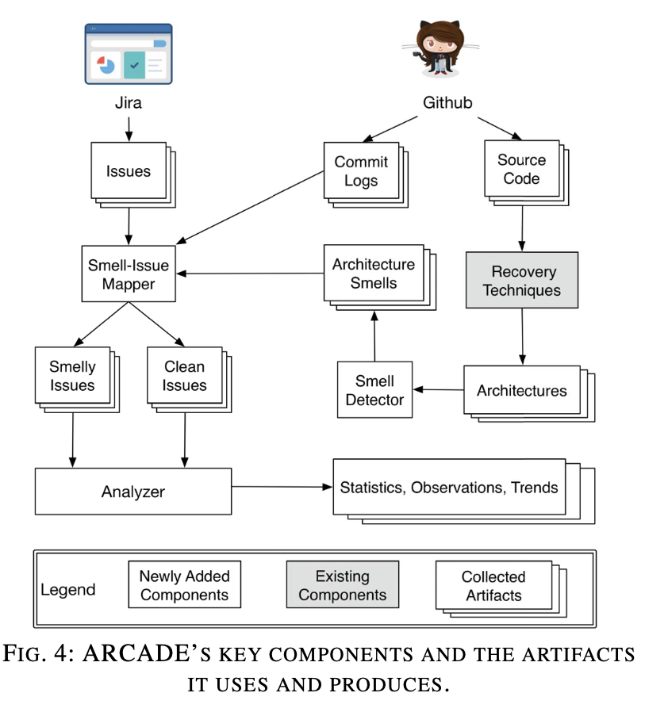

### 一、研究问题描述

## **1.1**   **基本概念**

本篇论文基于实例对开源软件架构衰退展开了研究。在软件开发的过程中，软件架构师对软件系统的各个方面做出了设计决策，这些设计决策汇聚在一起体现了软件的**架构**。在系统的整个生命周期中，也许会添加新的架构，也许会对现有的架构进行修改，因此文章中将架构定义为架构师**设计决策的集合**。

文章将一些考虑不周的设计决策定义为“**architectural smells**”，认为它导致软件系统在发展过程中产生严重的**架构衰退**——“**architectural decay**”。架构衰退指软件架构性能随着版本的迭代而可维护性降低的现象，会增加开发人员维护代码库的代价。

## **1.2** **前人工作总结**

文章首先总结了前人对于架构衰退的研究，概括了前人在此方向进行研究的三种“smell”并做出了点评。

**1）architectural smells**

作者认为先前的一些architectural smells的工作分析了架构衰退的表现及architectural smells的负面影响，但是研究的作者依靠自己的经验和小的案例研究，很难得出更一般的结论。

**2）code-level smells**

作者指出前人研究的代码级的code-level smells很少表示架构问题。

**3）design smells**

作者认为design smells的研究具有指导意义，但是design smells更倾向于关注与体系结构不一定相关的问题。

## **1.3** **基础知识**

**A、架构恢复 Architecture Recovery** 

Architecture Recovery是一种从软件中恢复出系统体系结构的技术，它将一个软件系统的架构使用图形表示，将组件作为顶点，组件之间的调用、依赖、耦合关系作为边。每个组件依次包含一组实体。

文章中提及了三种表现良好的架构恢复技术ACDC、ARC和PKG。

**B、架构味道 Architectural Smells** 

Architectural Smells指在软件开发中一些考虑不周的设计决策，本质上是组件、连接器、接口、模式、样式的不良使用。

**C、问题跟踪系统 Issue Tracking Systems**

文章使用**Jira**对issue进行追踪管理，当有用户提交issue时，开发人员将它们分类：bug、new feature、feature improvement、task to be performed等。每个问题都有一个状态：“open”—“resolved”—“closed”。作者将关注的issue范围限制在closed和fixed两种问题内，并根据issue的信息发现受影响的版本，并根据版本将Architectural Smells映射到issue。

### 二、实验方法及结论

## **2.1** **实验方法**

接下来文章具体介绍了研究工作的详细方法，对architectural smells进行选择、捕捉和检测。

作者确定了六种architectural smells，分别是：

**1.**   **Concern Overload ——关注重载、CO** 

**2.**   **Dependency Cycle ——依赖循环、DC**

****

**3.**   **Link Overload ——** **链接重载、LO**

**4.**   **Unused Interface ——未使用的接口**

**5.**   **Sloppy Delegation ——草率的委托**

**6.**   **Co-change Coupling ——协变耦合、CC**

这六种architectural smells涵盖了软件架构的四个重要方面：关注点concerns、依赖项dependencies、接口interfaces和耦合couplings。

## **2.2** **实验假设及相关定义**

研究问题：architectural smells如何在系统实现中体现出来？

作者的研究目标是寻找经验证据，证明“架构衰退对软件系统有负面影响”这个观点。但是架构衰退和负面影响是抽象的概念，为了衡量负面影响这个抽象指标，作者使用architectural smells和issue对抽象概念进行量化：他关注“检测到的architectural smells”和“报告中实现的issue”之间的关系，将两者之间的相关性视为一个重要的量化指标，认为它能够表明系统架构的衰退会导致开发人员在开发的过程中遇到问题和困难。

为了方便后续的研究假设的工作，作者设定了**smelly**和**clean**的概念：

\-    如果在系统版本中，文件受到该版本的恢复架构中发现的至少一种smells的影响，我们称该文件为“smelly”。否则，文件是“clean”。

\-    如果受问题影响的版本中至少有一个smelly文件涉及问题的解决，我们称之为“smelly”。如果不存在这样的文件，则问题是“clean”。

作者还提出了了两个假设：

\-    假设H1（**issue-proneness问题倾向性**）：smelly文件比clean文件更有可能有关联的issue。

\-    假设H2（**change-proneness变化倾向**）：smelly文件比clean文件更容易被改变。作者用第二个证明架构衰退会导致更多的维护工作。

## **2.3** **实验数据**

由于Apache维护高质量的代码库、发行说明和bug tracker，作者使用一组Apache开源项目进行研究，具体包括Camel、Continuum、CXF、Hadoop、Nutch、OpenJPA、Structs2、Wicket。

## **2.4** **实验工具**

为了能将研究的开源软件系统和版本、issues、平均LOC关联起来，作者扩展了架构恢复和分析工具套件**ARCADE**，使用它从开源软件系统中提取架构、使用smells detector检测smells、从Jira问题库中提取问题，并连接smells和issue，将issue划分为smelly或者clean。

## **2.5** **实验结果**

假设H1验证结果：

表格中统计出了在ACDC、ARC、PKG三种架构恢复技术下，每个文件平均的问题数的比例。表格中的乘法因子Factor从1.24到2.10不等，这意味着smelly文件中的问题率比clean文件增加了24%-110%，置信水平为95%。

假设H2验证结果：

表格中统计出了在ACDC、ARC、PKG三种架构恢复技术下，每个文件平均的修改次数的比例。分析数据发现smelly文件中的问题率比clean文件增加了10%-83%，置信水平为95%。

x轴表示文件大小，y轴表示在该文件大小中，smelly文件和clean文件的百分比。可以发现smell文件比例很大程度上独立于文件大小。这个结果似乎与以前代码级研究的结果不一致：架构衰退的症状与它们出现的实现文件的大小无关。

### 三、实验总结

本文根据8个Apache开源软件系统的421个版本的实例对architectural smells展开了研究，选择具有代表性的architectural smells：Concern Overload ——Concern重载、CO、Dependency Cycle ——依赖循环、DC、Link Overload —— 链接重载、LO、Unused Interface ——未使用的接口、Sloppy Delegation ——草率的委托、Co-change Coupling ——协变耦合、CC。实现了自动检测architectural smells的算法；

在实验方法上，本文引入了issue对抽象概念进行量化：作者关注“检测到的architectural smells”和“报告中实现的issue”之间的关系，将两者之间的相关性视为一个重要的量化指标，认为它能够表明系统架构的衰退会导致开发人员在开发的过程中遇到问题和困难。并定义了smelly文件和clean文件的概念，基于概念做出了两个假设：假设H1（issue-proneness问题倾向性）：smelly文件比clean文件更有可能有关联的issue。假设H2（change-proneness变化倾向）：smelly文件比clean文件更容易被改变。作者用第二个证明架构衰退会导致更多的维护工作。在后续的实验过程中对假设进行验证。

在实验工具上，作者扩展ARCADE模型对大量实例进行实验，在ACDC、ARC、PKG三种架构恢复技术下，统计了每个文件平均的修改次数和issue数量。充分证明了前文提出的两个假设，smelly的文件比clean文件修改次数更多，出现的问题也更多。

研究表明，architectural smells对编码有明显的负面影响，不良的架构导致需要在开发人员在系统的整个生命周期中增加维护工作，提高了开发的代价。

### 四、个人观点表达

这篇论文最吸引我的地方在于作者引入了issue对抽象smells概念进行量化。architectural smells和软件衰退程度本是两个抽象的概念，在我的印象里它更属于开发人员才能体会到的主观体会。但是这篇论文的作者精妙地将抽象的概念借用issue的数量进行具化处理，量化分析。为smells和软件衰退程度建立了桥梁。这篇文章给了我很大的启发，提醒我在未来的研究生生活中要努力开阔眼界，勤于思考，注重研究的方法。

虽然软件工程是一门实践类的学科，它仍需要有理论基础作为指导。同时也需要研究人员在实践中摸索道路总结规律，从实际生产中提取经验价值。

同时这篇论文也提醒着我学习软件架构的重要性。软件架构相当于软件的骨架和地基，具备良好架构的软件系统会具有更高的可维护性，反之，架构差的软件系统需要开发人员额外投入时间和精力去维护，降低了团队效率。

随着未来业务需求层出不穷、软件系统越来越复杂、团队越来越大、管理难度越来越高、软件开发过程中出现的问题越来越多，掌握软件架构知识是非常有必要的，计算机科学技术发展是日新月异的，要随时紧跟技术潮流提升自己。

